## Analysis that predict treatement for mental health condition in tech workplace

Amazinggrace Ogechukwu Oduye, 2020.

## Excutive summary

This document presents the analysis on mental health in the tech workplace, which is adapted from Open Source Mental Illness (OSMI), using survey data from years 2014, 2016, 2017, 2018 and 2019. Each survey measures and attitudes towards mental health and frequency of mental health disorders in the tech workplace.

The analysis was inspired by some questions worth exploring:
* How does the frequency of mental health illness and attitudes towards mental health vary by geographic location?. 
* What are the strongest predictors of mental health illness or certain attitudes towards mental health in the workplace?.

The analysis is based on 1259 observations from 27 feature survey questions on mental health in tech companies.

The goal is to predict wether an employee would sougth for a mental health condition or not in the cause of work in Tech company.


## Data exploration

There are 27 features in this dataset. Each row in the dataset represents responds to the feature question.

## Numeric value

* Timestamp indicate date and time the respondent was surved
* Age indicates the age of the worker surveyed

## categorical Reationship

In addition to the numeric values, the data set includes categorical features:
* Country-A categorical variable that indicates the different country of the worker surveyed
* Gender-A categorical variable that indicates the sex of the worker surveyed
* state-A categorical variable that indicates If you live in the United States, which state or territory do you live in
* self_employed-A categorical variable that indicates if a worker surveyed is self-employed
* family_history-A categorical variable that indicates if a worker surveyed, have a family history of mental illness
* treatment-A categorical variable that indicates if a worker surveyed, have you sought treatment for a mental health condition
* work_interfere-A categorical variable that indicates if a worker surveyed, If with mental health condition, do you feel that it interferes with your work
* no_employees: How many employees does your company or organization have
* remote_work-A categorical variable that indicates if a worker surveyed,do work remotely (outside of an office) at least 50% of the time
* tech_company-A categorical variable that indicates if your employer primarily a tech company/organization
* benefits-A categorical variable that indicates if employer provide mental health benefits
* care_options-A categorical variable that indicates if a worker surveyed, do know the options for mental health care your employer provides
* wellness_program-A categorical variable that indicates if  employer ever discussed mental health as part of an employee wellness program
* seek_help-A categorical variable that indicates if a worker surveyed employer provide resources to learn more about mental health issues and how to seek help
* anonymity-A categorical variable that indicates if anonymity of worker surveyed, is protected if you choose to take advantage of mental health or substance abuse treatment resources
* leave-A categorical variable that indicate how easy is it for worker surveyed to take medical leave for a mental health condition
* mental_health_ consequence-A categorical variable that shows the worker surveyed, who think that discussing a mental health issue with your employer would have negative consequences
* physical_health_consequence-A categorical variable that indicates if worker surveyed do think that discussing a physical health issue with your employer would have negative consequences
* coworkers-A categorical variable that shows the worker surveyed, who would be willing to discuss a mental health issue with your coworkers
* supervisor-A categorical variable that indicates if a worker surveyed would be willing to discuss a mental health issue with your direct supervisor(s)
* mental_health_interview-A categorical variable that shows the worker surveyed, who would you bring up a mental health issue with a potential employer in an interview 
* physical_healthinter_view-A categorical variable that indicates if a worker surveyed would bring up a physical health issue with a potential employer in an interview
* mental_vs_physical-A categorical variable that shows if worker surveyed, who feel that your employer takes mental health as seriously as physical health.
* observed_consequence-A categorical variable that indicates if a worker surveyed have heard of or observed negative consequences for coworkers with mental health conditions in your workplace

#### Age

Indicates the age of respondent of the survey question. it has outliers that was replace with the Median age since the maximum and Minimum values are are outliers, so median was the best fit. the survey shows that:
1. 25-29 age range dominate most of the workers 
1. 30-45 age range are not very few
1. 46-65 age range are few


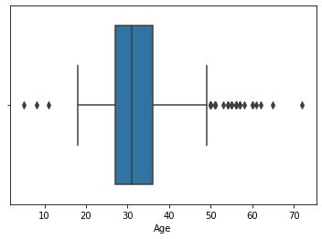


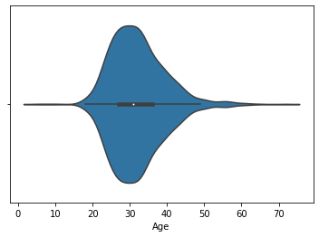


#### Gender

Indicates the sex of respondent of the survey question. it was categorize into three:
1. Male category with 79.03% occurance 
1. Female category with 19.94% occurance
1. Others 1.03%

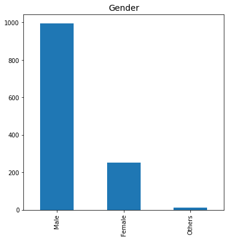


#### Country

Indicates the different country of the worker surveyed. The report shows that most workers are fom United State, the top five countries are:
1. United States 59.65% and value count of 751
1. United Kingdom 14.69% and value count of 185
1. Canada 5.72% and value count of 72
1. Germany 3.57% and value count of 45
1. Ireland and Netherland 2.14% and value count of 27

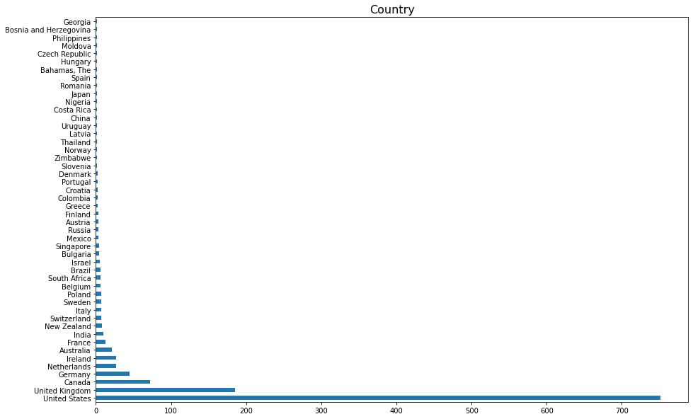


#### state

It indicates If you live in the United States, which state or territory do you live in. it has 485 unique values, 515 missing values that is about 40.5% respondent did not indicate their teritory while the top five state is 
1. CA-California with 18.55% respondent
1. WA-Washington with 9.41% respondent
1. NA-New York with 7.66% respondent
1. TN-Tennessee with 6.04% respondent
1. TX- Texas with 5.91% respondennt

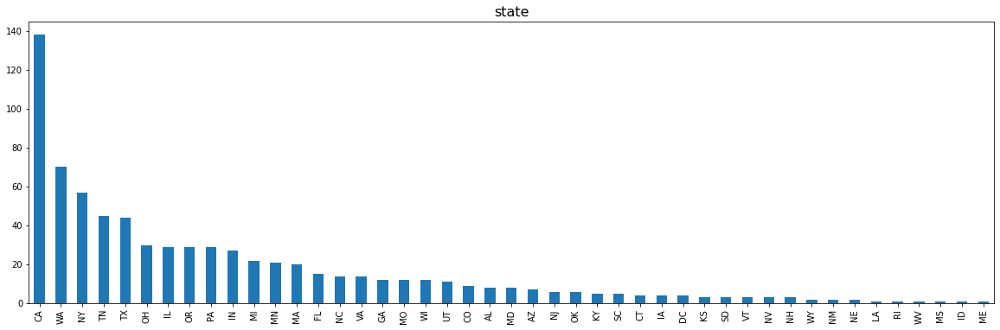


#### self_employed
It indicates the number of surveyed tech workers who Are self-employed or not, it has 2 unique values and 18 missing values. The survey  report shows that:
1. No 88.24% repondent are not self-employed and value count of 1095
1. Yes 11.76% repondent are self-employed and value count of 146

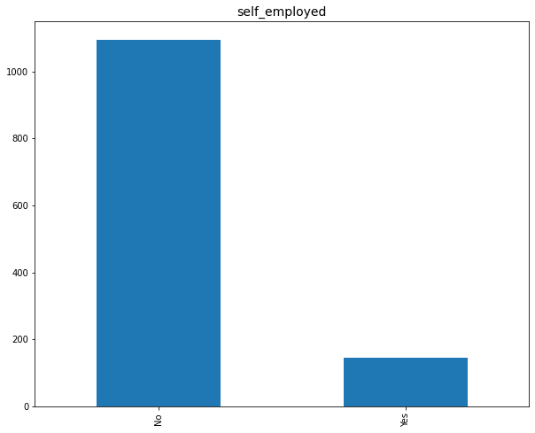

#### family_history

Indicates if respondent have a family history of mental illness, it has two unique values with no missing value. The frequency of occurance shows that:
1. No  respondent is 60.92%
1. Yes respondent is 39.08%

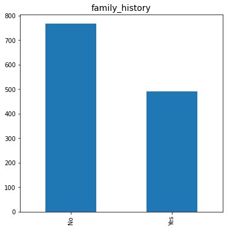


#### treatment

Indicates if respondent have sought treatment for a mental health condition, it has two unique values with no missing value. The frequency of occurance shows that:
1. Yes  respondent is 50.60% and value count of 637
1. No respondent is 50.60% and value count of 622


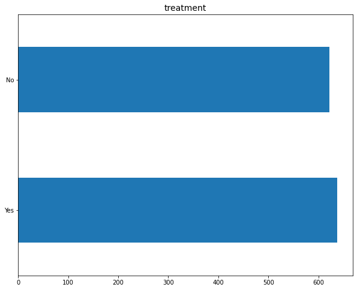

#### work_interfere

indicates If a worker with mental health condition, do you feel that it interferes with your work it has four unique values and 264 missing values. the survey report shows that:
1. Sometimes 46.73% of tech workers thicks it interfers with work.
1. Never 21.41% of respondent thinks it doesnot.
1. Rarely 17.39% of tech workers thicks it interfers with work.
1. Often 14.47% of tech workers thicks it interfers with work.

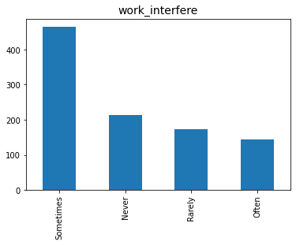


#### no_employees

Indicates the range of employees in tech company or organization. it has 6 unique values and no missing values. the survey report shows that most company do have:
1. 6-25 respondent is 23.03% and value count of 290
1. 26-100 respondent is 22.95% and value count of 289
1. More than 1000 respondent is 22.4% and value count of 282
1. 100-500 respondent is 13.98% and value count of 176
1. 1-5 respondent is 12.87% and value count of 162
1. 500-1000 respondent is 4.77% and value count of 60

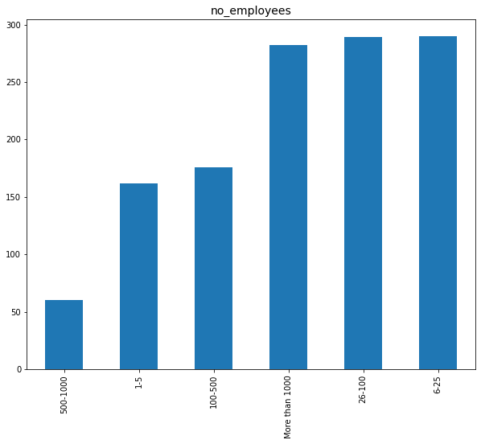


#### remote_work

indicates number of workers that do work remotely (outside of an office) at least 50% of the time. it ha two unique values with no missing value. The survey shows that:
1. No 70.14% donot work remotely
1. Yes 29.86% work remotely

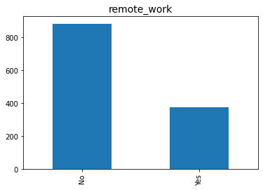


#### tech_company

indicates if respondent employer primarily a tech company/organization. it has two unique values with no missing value. The survey shows that:
1. Yes 81.89% respondent and value count of 1031 is Tech company
1. No 18.11% respondent and value count of 228 is not Tech company

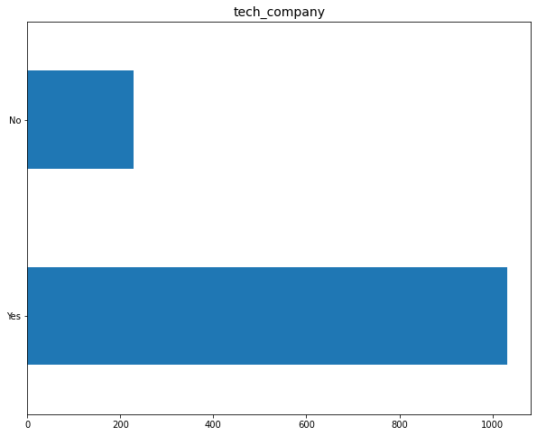


#### benefits

indicates if employer provide mental health benefits,it has three unque value with no missing value. the survey shows that:
1. Yes 37.89% respondent are provide with mental health benefits 
1. Don't know 32.41% respondent are not aware of mental health benefits
1. No 29.7% respondent are not provided with mental health benefits

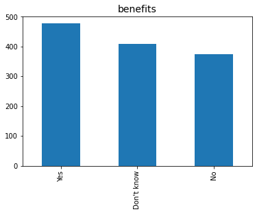


#### care_options

indicates if employee know the options for mental health care your employer provides,it has three unque value with no missing value. the survey shows that:
1. No 39.79% respondent and value count of 501 donot know the options for mental health care employer provides
1. Yes 35.27% respondent and value count of 444 know the options for mental health care employer provides        
1. Not sure 24.94% respondent and value count of 314 are not sure the options for mental health care employer provides 

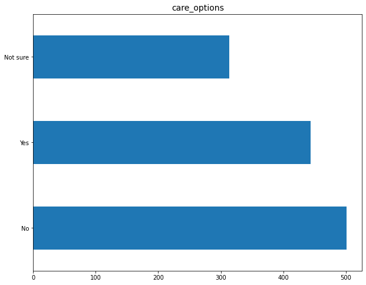


####  wellness_program 

indicates if employer ever discussed mental health as part of an employee wellness program. It contains three unique values and no missing values the survey shows that:
1. No 66.88% respondent empolyers donot discuss mental health as part of an employee wellness program. 
1. Yes 18.19% respondent empolyers discuss mental health as part of an employee wellness program
1. Don't know 14.93% are not sure if employers do or not.

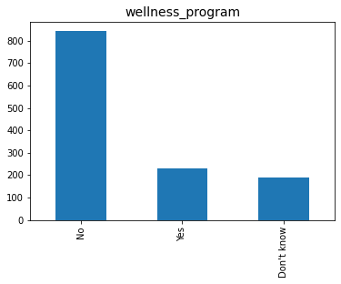


####  seek_help 

indicates if employer provide resources to learn more about mental health issues and how to seek help. It contains three unique values and no missing values. the survey shows that:
1. No 51.31% and value count of 646 respondent employer donot provide resources to learn more about mental health issues and how to seek help         
1. Don't know 51.31% and value count of 363 respondent are not aware if employer donot provide resources to learn more about mental health issues and how to seek help       
1. Yes 51.31% and value count of 250 respondent employer provide resources to learn more about mental health issues and how to seek help            

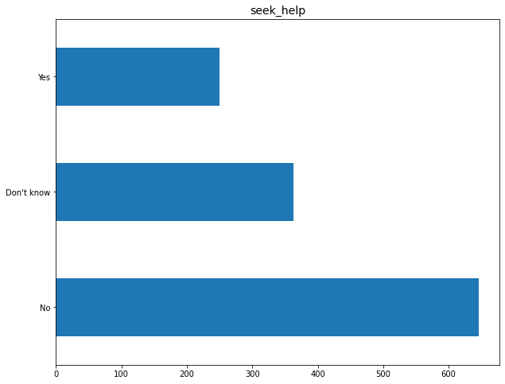


####  anonymity

indicates if anonymity of worker surveyed, is protected if you choose to take advantage of mental health. It contains three unique values and no missing values the survey shows that:
1. Don't know 65.05% respondent are not sure if their anonymity is protected. 
1. Yes 29.79% respondent think their anonymity is protected. 
1. No 5.16% respondent think their anonymity is not protected.


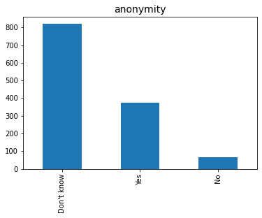

####  leave

indicates how easy is it for a worker to take medical leave for a mental health condition in tech company. It contains 5 unique values and no missing values the survey shows that:
1. Don't know 44.72% respondent and value count of 563
1. Somewhat easy 21.13% respondent and value count of 266
1. Very easy 44.72% respondent and value count of 206
1. Somewhat difficult 10.01% respondent and value count of 126
1. Very difficult 7.78% respondent and value count of 98

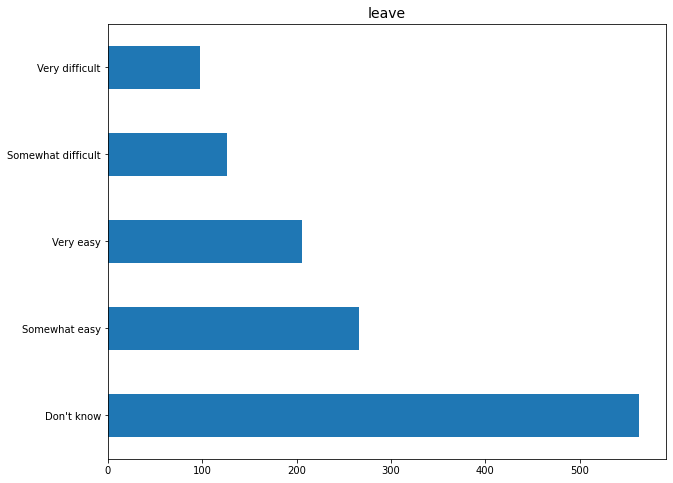


####  mental_health_ consequence

indicates employees who think that discussing a mental health issue with your employer would have negative consequences. It contains three unique values and no missing values the survey shows that:
1. No 38.92% respondent are sure that discussing a mental health issue with your employer would have no negative consequences. 
1. Maybe 37.89% respondent think it may or may not have negative consequences. 
1. Yes 23.19% respondent are sure that discussing a mental health issue with your employer would have negative consequences..

 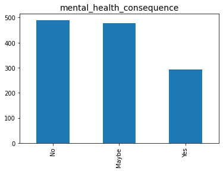          


####  phys_health_consequence

indicates employees who think that discussing physical health issue  with your employer would have negative consequences. It contains three unique values and no missing values the survey shows that:
1. No 73.47% respondent and value count of 925. 
1. Maybe 21.68% respondent and value count of 273.
1. Yes 4.85% respondent and value count of 61
           
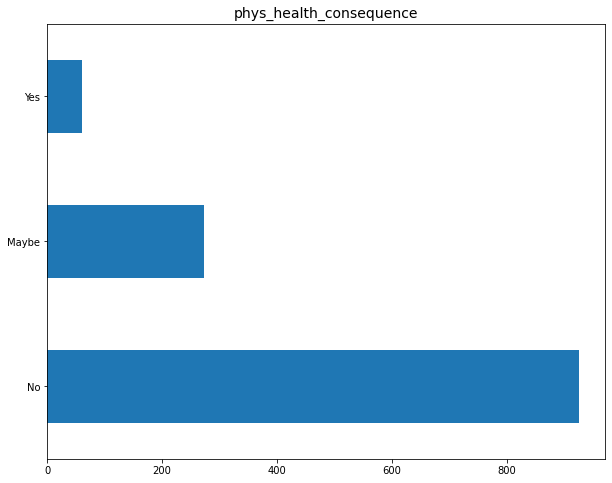  


####  coworkers

indicates the number of employees who Would  be willing to discuss a mental health issue with coworkers. It contains three unique values and no missing values the survey shows that:
1. Some of them 61.48% respondent Would be willing to discuss a mental health issue with some coworkers. 
1. No 20.65% respondent Would not be willing to discuss a mental health issue with coworkers. 
1. Yes 17.87% respondent Would be willing to discuss a mental health issue with coworkers.

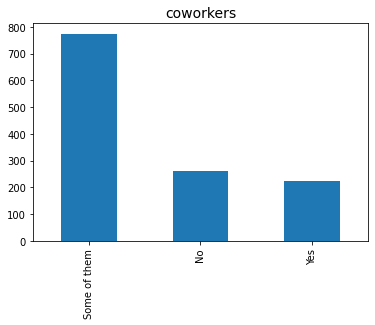           


####  supervisor

indicates the number of employees who would be willing to discuss a mental health issue with your direct supervisor. It contains three unique values and no missing values the survey shows that:
1. Yes 73.47% respondent and value count of 516 
1. No 31.22% respondent and value count of 393
1. Some of the 27.8% respondent and value count of 350          

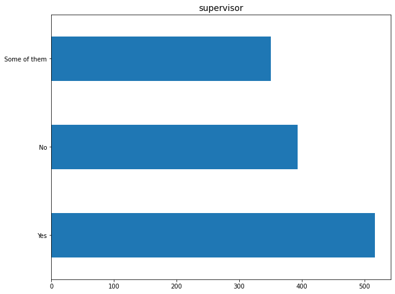 


####  mental_health_interview

indicates the number of employees who would bring up a mental health issue with a potential employer in an interview. It contains three unique values and no missing values the survey shows that:
1. No 80.06% respondent would not bring up a mental health issue with a potential employer in an interview. 
1. Maybe 16.44% respondent may or maynot bring up a mental health issue with a potential employer in an interview. 
1. Yes 3.49% respondent would bring up a mental health issue with a potential employer in an interview.

           


####  phys_health_interview

indicates the number of employees who would bring up a physical health issue  with a potential employer in an interview. It contains three unique values and no missing values the survey shows that:
1. Maybe 44.24% respondent and value count 557
1. No 39.71% respondent and value count 500
1. Yes 16.04% respondent and value count 202

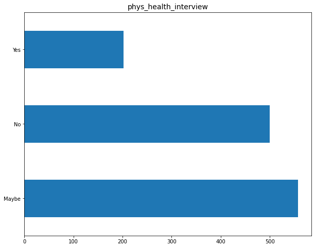            


####  mental_vs_physical

indicates the number of employers who feel that their employer takes mental health as seriously as physical health. It contains three unique values and no missing values the survey shows that:
1. Don't know 45.75% respondent are not sure if their employer takes mental health as seriously as physical health. 
1. Yes 27.24% respondent are sure employer takes mental health as seriously as physical health. 
1. No 27.01% respondent employee does not take mental health as seriously as physical health.

 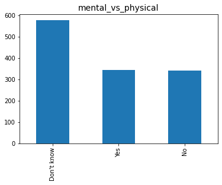           


####  obs_consequence

indicates if an employees has heard of or observed negative consequences for coworkers with mental health conditions in your workplace. It contains 2 unique values and no missing values the survey shows that:
1. No 85.39% respondent and value count 1075
1. Yes 14.62% respondent and value count 184

  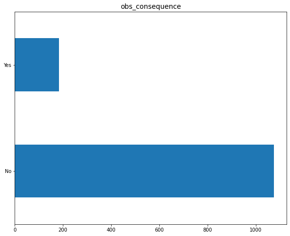         


```python

```
